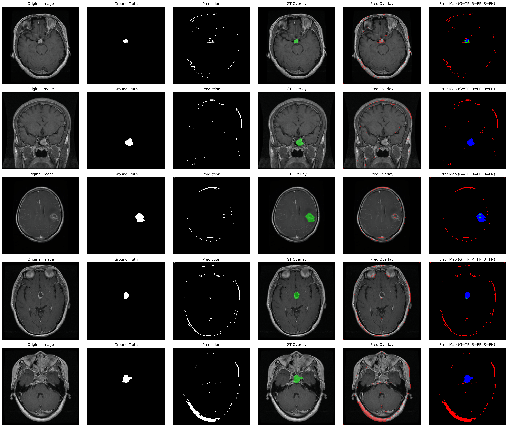

# Brain Tumor Segmentation

This repository contains a modular PyTorch pipeline for brain tumor segmentation using a custom lightweight U-Net architecture (`DynamicLiteUNet`). 

The model was trained to perform binary segmentation (Background vs. Tumor) on MRI scans.

## 🚀 Features
- **DynamicLiteUNet Architecture**: Utilizes mixture-of-experts depthwise convolutions, gated skip connections, and a global depthwise bottleneck.
- **Mean Teacher SSL Integration**: Leverages unannotated images for Consistency Regularization. Trains a Student model with noise/perturbations and maintains a stable Exponential Moving Average (EMA) Teacher model.
- **Deep Supervision**: Auxiliary outputs from intermediate decoder stages to stabilize training.
- **Robust Loss Function**: Combines Dice Loss, Cross-Entropy Loss, and Sobel-weighted Boundary Loss.
- **Data Augmentation**: MixUp, CutMix, and geometric transformations via Albumentations.
- **Test-Time Augmentation (TTA)**: Averages predictions over flips and rotations for robust inference.
- **Automated Evaluation**: Computes 12 extended metrics (IoU, DSC, HD95, etc.) with Mean ± Std bounds.

## 📊 Evaluation Results

The model was evaluated on the test set. Below is the extended evaluation matrix showing Mean ± Standard Deviation across the test images.

*(Note: These results represent a quick 5-epoch training run on a 100-image subset. For optimal performance, train on the full dataset for 50-100 epochs).*

| Evaluation Metric | Value |
|-------------------|-------|
| Network | DynamicLiteUNet |
| IoU (% ↑) | 4.90 ± 9.97 |
| DSC (% ↑) | 7.99 ± 14.36 |
| Precision (% ↑) | 11.30 ± 20.47 |
| Recall/Sens (% ↑) | 10.27 ± 20.34 |
| Specificity (% ↑) | 98.70 ± 2.47 |
| Accuracy (% ↑) | 97.43 ± 2.68 |
| HD95 (mm ↓) | 96.08 ± 20.47 |
| ASD (mm ↓) | 53.36 ± 23.49 |
| VOE (% ↓) | 95.10 ± 9.97 |
| L-F1 (% ↑) | 7.99 ± 14.36 |
| F1-score (% ↑) | 7.99 ± 14.36 |
| MCC (% ↑) | 8.17 ± 15.43 |

## 🖼️ Visualizations

The testing phase generates advanced prediction overlays to help diagnose model behavior:



*(Error Map Legend: Green = True Positive, Red = False Positive, Blue = False Negative)*

Training curves are also generated to track Loss and Dice convergence:


## 🛠️ Usage

### Installation
```bash
pip install -r requirements.txt
```

### Running the Pipeline
You can train and test the model using the provided CLI:

```bash
# Standard run (uses SSL and trains on a subset by default)
python train.py

# Full dataset run (specify max bounds and 3 epochs)
python train.py --epochs 3 --batch-size 16 --unlabeled-batch-size 16 --max-train 10000 --max-test 10000

# Disable SSL (train baseline model)
python train.py --no-ssl
```

## 📁 Repository Structure

- `dataset.py` — `UNetDataset` and `UnlabeledDataset` (for SSL) with robust caching.
- `model.py` — `DynamicLiteUNet` implementation.
- `trainer.py` — Contains standard `Trainer` and `MeanTeacherTrainer` with SSL consistency logic.
- `losses.py` — `CombinedLoss` (Dice + CE + Boundary).
- `metrics.py` — Comprehensive evaluation metrics.
- `inference.py` — Test-Time Augmentation (TTA) and visual rendering.
- `config.py` — Hyperparameters and path configurations.
- `train.py` — Main entry point tying the pipeline together.
